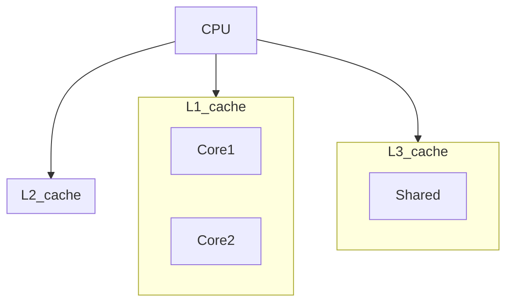

В процессорах каждый уровень кеша устроен по‑разному: L1 и L2 обычно распределены между конкретными ядрами, а только L3 (и выше) может быть общим для всех. В Go это имеет значение, так как горутины выполняются на разных ядрах и при конкурентной работе с общей структурой данных возможно ложное совместное использование, когда соседние переменные оказываются в одной кеш‑линии. В итоге ядра постоянно синхронизируют кеши между собой, хотя каждая горутина обращается к независимой переменной.  

Чтобы избежать этого эффекта, в Go используют выравнивание или `sync/atomic` с учетом кеш‑линий. Правильная организация памяти снижает издержки на межядерную синхронизацию и повышает пропускную способность параллельных программ.  



```old
// Знание того, что более низкие уровни кэша CPU не используются совместно всеми ядрами, помогает избежать снижающих производительность паттер- нов конкурентного кода, например ложного совместного использования. Совместное использование памяти — это иллюзия.
```