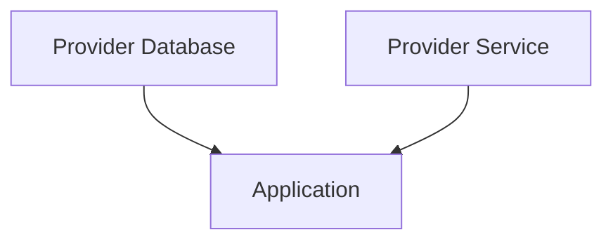

Wire от Google — это инструмент для Go, который помогает реализовать внедрение зависимостей на этапе компиляции, избегая рефлексии и лишних накладных расходов. Разработчик описывает зависимости в виде провайдеров, после чего Wire генерирует код, который связывает все нужные компоненты. Это упрощает тестирование, структурирует проект и предотвращает ошибки, которые могли бы проявиться только в рантайме.  

Принцип работы можно изобразить как построение графа зависимостей, где Wire автоматически собирает готовый объект из меньших частей:  



Репозиторий https://github.com/google/wire содержит документацию и примеры, показывающие как описывать провайдеры и запускать генерацию кода через `wire`, что делает процесс внедрения зависимостей простым, безопасным и прозрачным.

```old
// [Compile-time Dependency Injection for Go](https://github.com/google/wire)
```