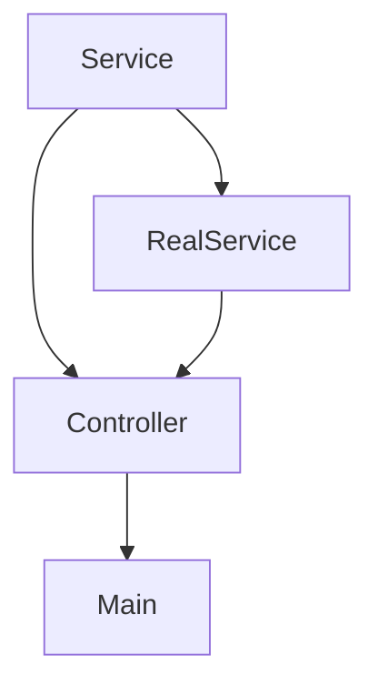

Dependency Injection в Go — это способ построения гибких и тестируемых программ путем передачи зависимостей в функции или структуры снаружи, а не внутри них. Вместо того чтобы объект сам создавал все необходимые компоненты, они подготавливаются заранее и "вкладываются" в него, что упрощает замену зависимостей и позволяет использовать, например, фейковые реализации при тестировании.  

На видео объясняется, что в Go это достигается через явные аргументы функций и структуры, без сложных фреймворков. Такой подход делает код более прозрачным и управляемым, а также способствует слабой связности компонентов.  

```go
type Service interface {
    DoWork()
}

type RealService struct{}
func (r RealService) DoWork() { fmt.Println("Работаю...") }

type Controller struct {
    svc Service
}

func NewController(s Service) *Controller {
    return &Controller{svc: s}
}

func main() {
    real := RealService{}
    c := NewController(real)
    c.svc.DoWork()
}
```



```old
// [Dependency Injection](https://youtu.be/0Fhsgmz-Gig?list=PLZvfMc-lVSSO2zhyyxQLFmio8NxvQqZoN&t=1001)
```