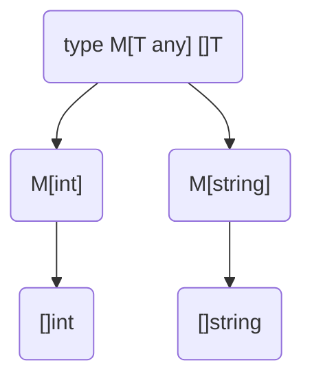

В Go конструкция `type M[T any] []T` объявляет обобщённый тип, который является именованным срезом для элементов произвольного типа `T`. Такой тип можно рассматривать как «обёртку» над срезом, где параметр `T` задаёт конкретный тип элементов при использовании. Это позволяет определять методы для среза конкретного вида и повторно использовать общую логику обработки данных без дублирования кода.  

Пример:  
```go
type M[T any] []T

func (m M[T]) First() (T, bool) {
    if len(m) == 0 {
        var zero T
        return zero, false
    }
    return m[0], true
}
```  

Диаграмма для понимания:  


```old
// как озвучить type M[T any] []T - дженерик для слайса, определяемый параметром типа
```