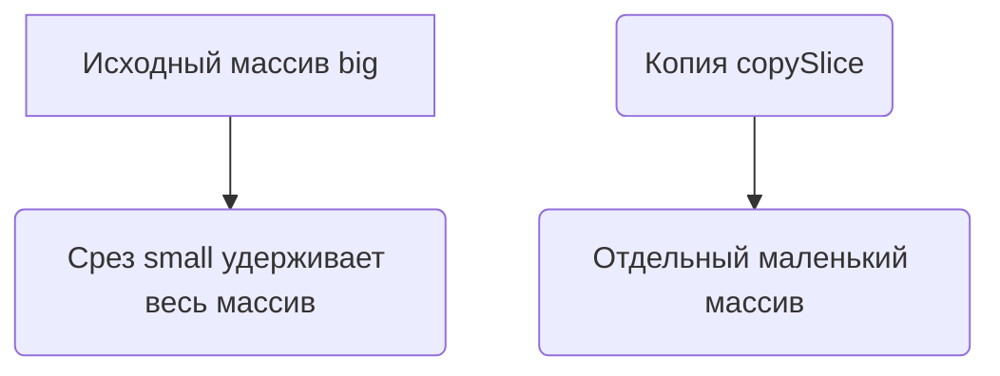

В Go срезы ссылаются на один общий массив, и при создании нового среза из большого — даже если берётся лишь малая часть — в памяти может оставаться привязанным весь исходный массив. Это значит, что сборщик мусора не освободит память для неиспользуемых элементов, пока существует хотя бы одна ссылка на этот массив.  

Чтобы избежать лишнего удержания памяти, используют копирование нужных элементов в новый срез. Таким образом создаётся отдельный массив меньшего размера, и оставшаяся часть исходного будет корректно очищена сборщиком мусора.  

Пример:  
```go
big := make([]int, 1_000_000)
small := big[:10]         // удерживает весь массив big
copySlice := append([]int(nil), small...) // освобождает big
```  

Диаграмма:  


```old
// В качестве эмпирического правила запомните, что нарезка большого среза или массива может потенциально привести к высокому потреблению памяти. Остающееся в памяти пространство не будет восстановлено сборщиком мусора, и мы можем сохранять в памяти очень большой резервный массив, несмотря на использование только нескольких элементов. Использование копии среза — это способ предотвращения такой ситуации.
```