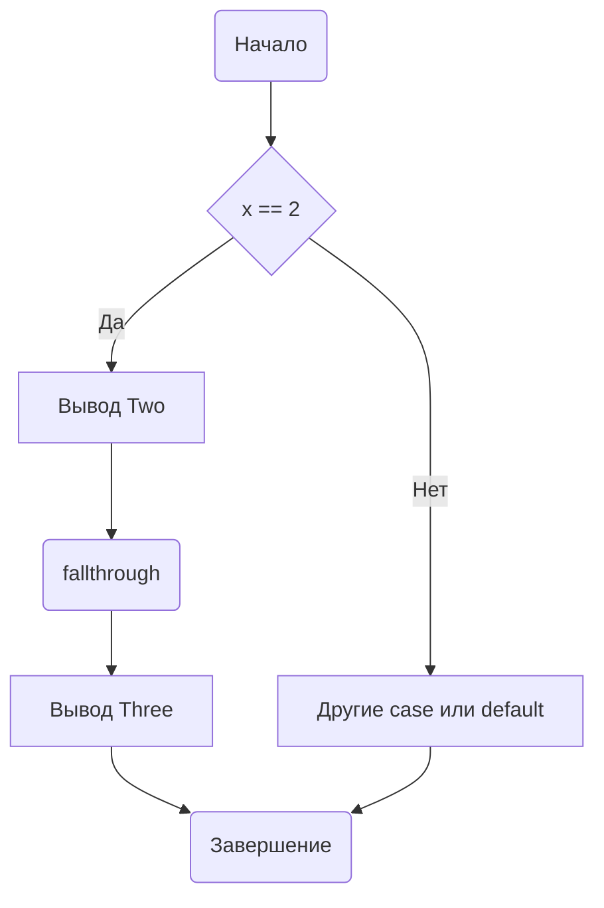

В Go оператор `fallthrough` используется внутри конструкции `switch` для явного указания, что после выполнения кода в одном `case` нужно перейти к следующему и выполнить его тело, даже если условие следующего `case` не совпадает. Это отличается от языка C, где "проваливание" происходит по умолчанию, поэтому в Go это действие является осознанным и явным.  

Пример:  

```go
package main

import "fmt"

func main() {
    x := 2
    switch x {
    case 1:
        fmt.Println("One")
    case 2:
        fmt.Println("Two")
        fallthrough
    case 3:
        fmt.Println("Three")
    default:
        fmt.Println("Other")
    }
}
```

Результат будет выводить `Two` и сразу затем `Three`, хотя значение переменной `x` не равно `3`. Это наглядно демонстрирует механизм "проваливания" с помощью `fallthrough`.  

Диаграмма выполнения:  



```old
// fallthrough - "проваливаться" - переход в следующий case (без его проверки), или в default
```