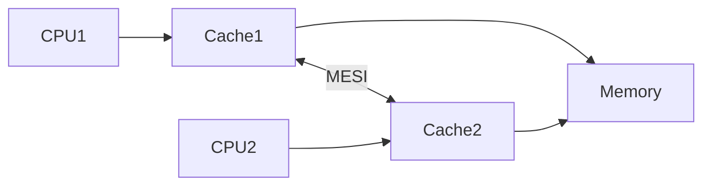

MESI протокол внутри процессора гарантирует согласованность кэшей между ядрами, что критично для корректной работы параллельных программ на Go. Когда горутины обращаются к одной и той же области памяти, изменения в одном ядре должны быть видны другим. MESI решает это, меняя состояние кэш-линий и синхронизируя данные, устраняя ситуации «грязного чтения».  

Таким образом, высокоуровневые примитивы синхронизации Go, такие как мьютексы и каналы, на аппаратном уровне опираются на MESI. Он обеспечивает, чтобы при блокировках или обмене данными между потоками, память действительно синхронизировалась между ядрами, а состояние было консистентным.  



```old
// Внутри CPU используется протокол MESI, гарантирующий когерентность кэша. Он отслеживает каждую кэш-линию, помечая ее как измененную, эксклюзивную, совместно используемую или недействительную (Modified, Exclusive, Shared и Invalid).
```