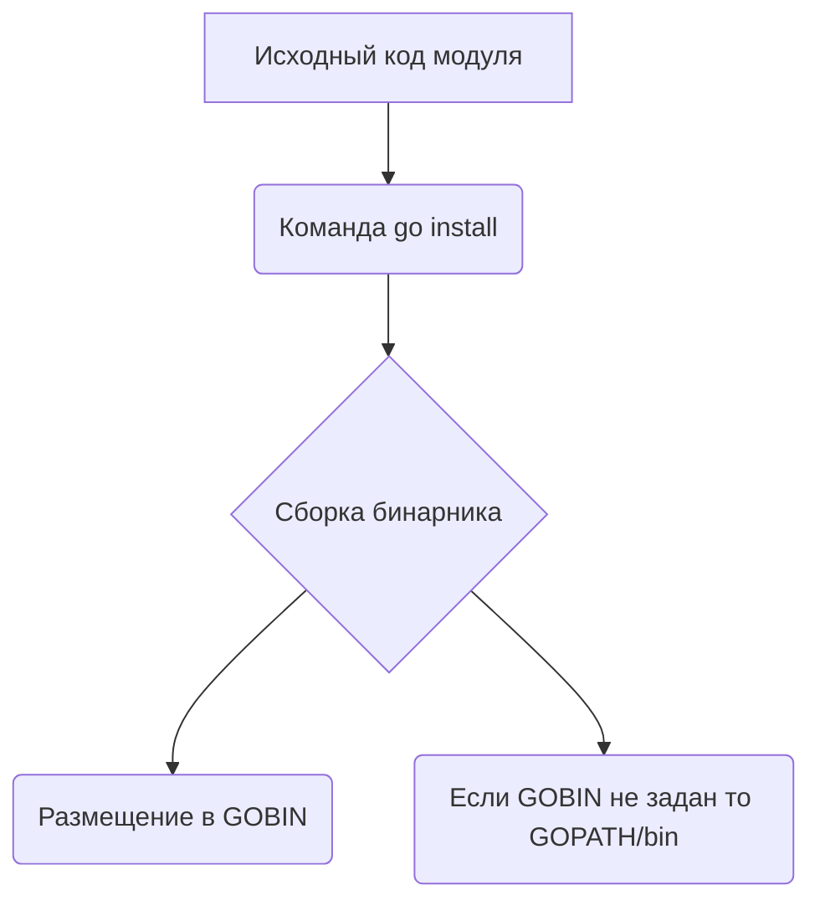

Команда `go install` выполняет сборку пакета или модуля и помещает готовый бинарный файл в каталог `$GOPATH/bin` или в `$GOBIN`, если он определён. Несмотря на то что использование `GOPATH` как основного механизма организации кода устарело и большинство проектов работают через модули и `go.mod`, именно место установки бинарников всё ещё завязано на эти переменные окружения. Таким образом, ключевая особенность в том, что хотя сам `GOPATH` используется всё меньше, механизм установки через `go install` продолжает полагаться на него для хранения исполняемых файлов.  

Визуально можно отразить так:  



```old
// `go install` выполнит сборку и установку модуля локально в системе в `GOPATH`, хотя всё остальное про `GOPATH` - устарело
```