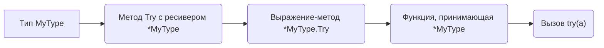

В Go существует разница между "методом-значением" и "методом-выражением". Если метод сохраняется от конкретного экземпляра, то он замыкается на этот инстанс и можно вызвать его как обычную функцию без дополнительных аргументов. А если метод берётся от типа, то получится функция, ожидающая явную передачу ресивера. Поэтому `(*MyType).Try` — это выражение-метод, возвращающее функцию с аргументом `*MyType`, и вызвать его можно, передав экземпляр, например `try(a)`.

```go
type MyType struct{}
func (m *MyType) Try() {}

var a *MyType
try := (*MyType).Try
try(a)
```



```old
// type MyType struct{}; func (a *MyType) Try() {}; var a *MyType; try := (*MyType).Try; try(a); - выражение-метод, работает и с (*MyType).Try и с MyType.Try в зависимости от того, как передаётся рессивер ("значение-метод" - это метод в переменной от инстанса, "выражение-метод" - это метод в переменной от типа)
```