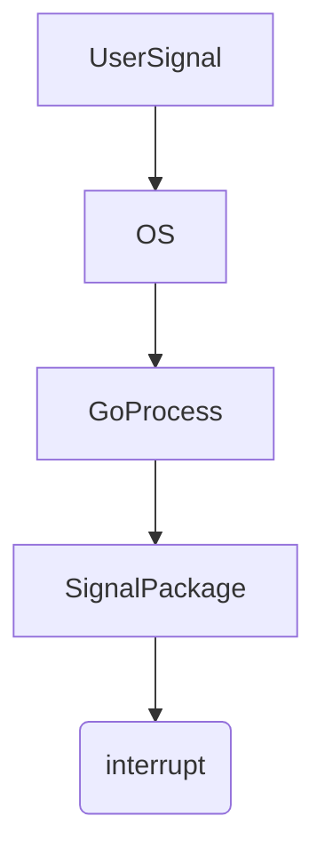

В Go для перехвата сигналов от операционной системы используется пакет `os/signal`. На первый взгляд кажется корректным напрямую слушать `syscall.SIGINT`, однако idiomatic-подход заключается в использовании `os.Interrupt`, который равен `syscall.SIGINT`, но абстрагирует платформо-зависимые детали и делает код переносимым. Таким образом `signal.Notify(interrupt, os.Interrupt, syscall.SIGTERM)` — верный способ, так как `os.Interrupt` предназначен для кросс-платформенной работы, тогда как `syscall.SIGINT` может повести себя по-разному на разных системах.  

Диаграмма взаимодействия:  


```old
// signal.Notify(interrupt, syscall.SIGINT, syscall.SIGTERM) - неправильно, signal.Notify(interrupt, os.Interrupt, syscall.SIGTERM) - правильно. os.Interrupt == syscall.SIGINT
```