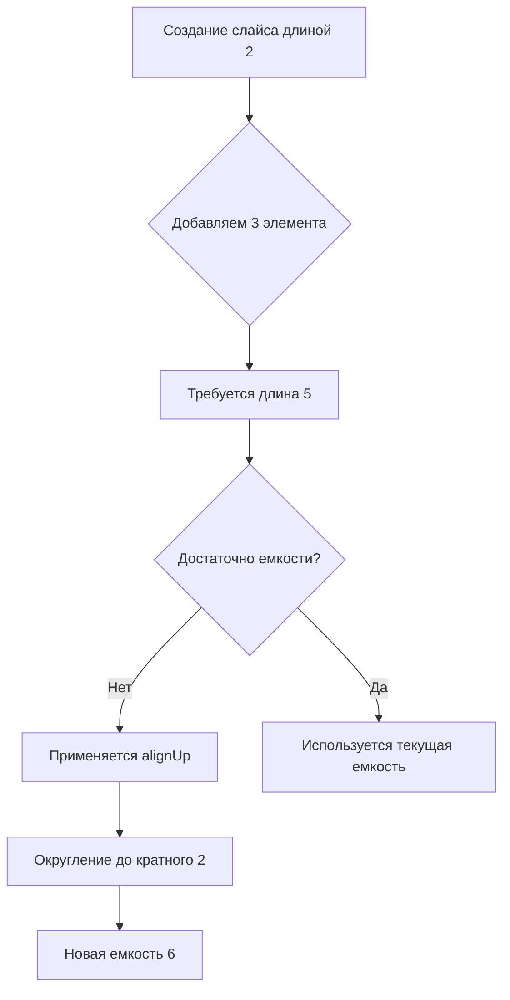

В Go при добавлении элементов в слайс может произойти перераспределение памяти и увеличение его вместимости. Алгоритм роста устроен так, что новый размер вычисляется функцией `grow` через округление вверх до ближайшего кратного степени двойки (alignUp). Именно поэтому вместимость часто увеличивается кратно 2, а итоговая емкость после добавления элементов может оказаться больше, чем просто старый размер плюс новые элементы.  

В приведенном примере стартовый слайс длиной 2 дополняется тремя элементами, требуя итоговой длины 5. Алгоритм роста выбирает новую вместимость не минимально достаточную, а округленную согласно правилу степени двойки, в результате получается 6. Подробное объяснение механизма роста слайсов описано здесь: https://habr.com/ru/articles/660827/  



```old
// a := []int{1, 2}; a = append(a, []int{3, 4, 5}...); println(cap(a)) // 6 - прибавляет всегда чётное число, равное len(a) или больше на 1. Фокус, когда добавляемых элементов больше, чем размер исходного слайса. При этом финальный размер должен быть больше либо равен 5. Ответ: alignUp rounds n up to a multiple of a. a must be a power of 2. Дополнительно: https://habr.com/ru/articles/660827/
```