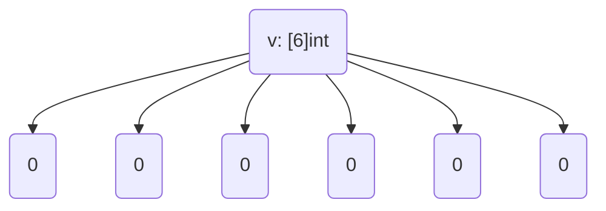

В Go при создании массива через литерал `[...]int{5:0}` используется так называемая keyed инициализация: элемент с индексом `5` получает значение `0`, а длина массива автоматически становится равной `6` (так как индексация начинается с нуля). Все остальные элементы массива, которым не были явно заданы значения, получают значения по умолчанию для этого типа, то есть тоже `0`.  

В результате переменная `v` будет массивом типа `[6]int` со значениями `{0, 0, 0, 0, 0, 0}`.  

```go
package main

import "fmt"

func main() {
    v := [...]int{5: 0}
    fmt.Println(v) // [0 0 0 0 0 0]
}
```  

Диаграмма:  



```old
// v := [...]int{5: 0} - что лежит в v?
```