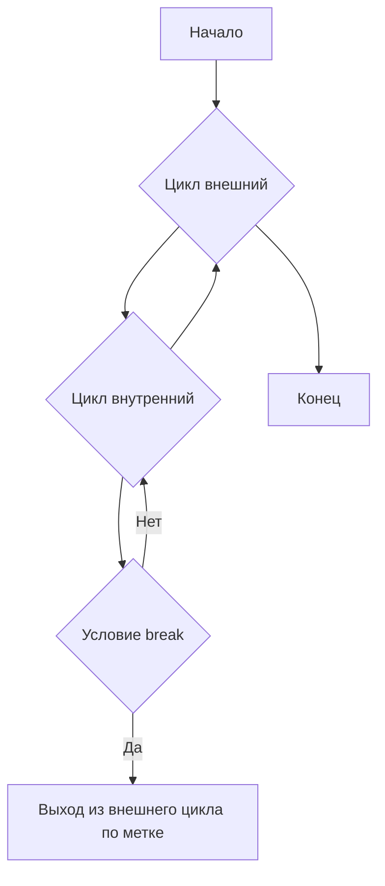

Оператор `break` в Go всегда останавливает выполнение только самого внутреннего цикла `for` либо конструкции `switch` или `select`, в которой он находится. Это значит, что если конструкции вложены друг в друга, `break` не выйдет наружу дальше, а лишь завершит ближайший блок управления потоком.  

Таким образом, при проектировании вложенных циклов или выборок стоит учитывать это правило, иначе можно столкнуться с неожиданным поведением, когда выполнение прекращается не там, где ожидалось. Чтобы выйти из внешнего уровня, чаще используют метки.  

```go
outer:
for i := 0; i < 3; i++ {
    for j := 0; j < 3; j++ {
        if j == 1 {
            break outer // прерывает внешний цикл
        }
    }
}
```  



```old
// Важное правило, о котором следует помнить, заключается в том, что оператор break завершает выполнение самого последнего оператора for, switch или select.
```