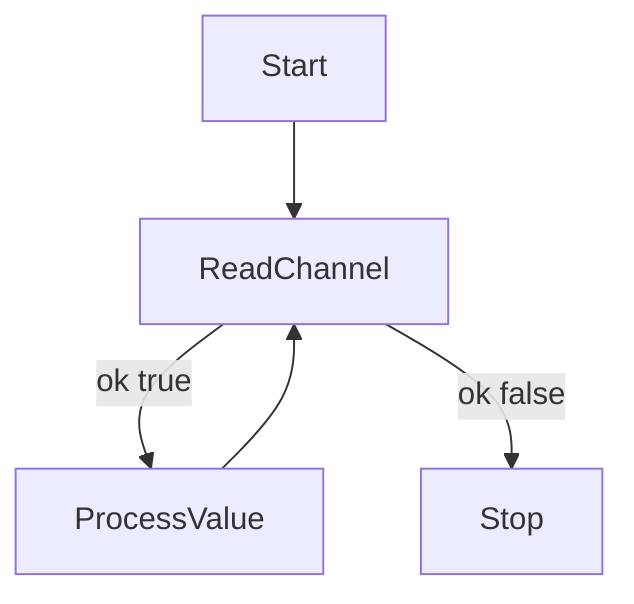

В Go при чтении из канала можно использовать форму присваивания `value, ok := <-channel`. Здесь переменная `ok` показывает, был ли канал открыт в момент чтения. Если `ok == true`, то удалось получить значение из канала. Если же `ok == false`, значит канал уже закрыт, и больше значений из него не поступит. Это удобно, чтобы корректно завершить обработку данных и избежать бесконечного ожидания.  

Пример:  
```go
j, ok := <-jobs
if !ok {
    // канал закрыт, завершаем работу
}
```  

Диаграмма:  


```old
// j, ok := <-jobs - проверка, что канал закрыт
```