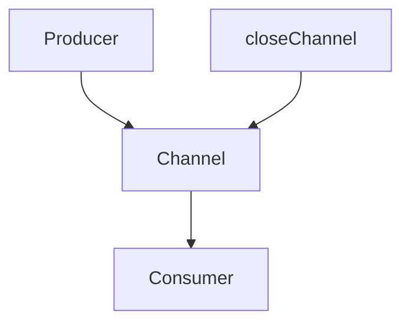

В Go оператор `for n := range ch {}` позволяет итерироваться по значениям из канала до его закрытия. Ошибка возникает, если чтение продолжается, но канал никогда не закрывается — цикл будет ждать новые данные бесконечно, создавая блокировку. Закрытие канала — это сигнал всем читателям, что значения больше не придут, и без него программа может «зависнуть» на чтении.  

Правильный подход — гарантировать закрытие канала отправителем, когда данные больше не нужны. Это особенно важно в случаях, где чтение блокируется, например при использовании конструкции `<-done`.  

```go
package main

import "fmt"

func main() {
    ch := make(chan int)
    go func() {
        for i := 0; i < 3; i++ {
            ch <- i
        }
        close(ch) // важно закрыть канал
    }()
    for n := range ch {
        fmt.Println(n)
    }
}
```



```old
// for n := range ch {} - классическая ошибка - забыть закрыть канал, тогда будет блокировка типа <-done без пары записи в канал
```