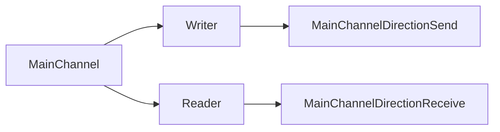

В Go каналы могут быть объявлены как двунаправленные (по умолчанию), а также как только для чтения или только для записи. Это используется главным образом для обеспечения безопасности на уровне типов: функцию можно ограничить так, чтобы она лишь отправляла данные в канал, но не могла их читать, или наоборот. Такой приём улучшает читаемость, уменьшает вероятность ошибок и повышает предсказуемость кода при работе с конкурентностью.  

Важно понимать, что закрыть канал можно только через значение исходного двунаправленного канала. Однонаправленный канал является лишь «проекцией» исходного, поэтому операция закрытия на нем невозможна. Это ещё один уровень защиты: функция, получившая доступ только к каналу на чтение, не способна повлиять на жизненный цикл канала.  

```go
func sendData(out chan<- int) {
    for i := 0; i < 3; i++ {
        out <- i
    }
    // закрывать канал здесь нельзя, нужен исходный двунаправленный
}

func main() {
    c := make(chan int)
    go sendData(c)
    for v := range c {
        fmt.Println(v)
    }
}
```



```old
// make(<-chan bool) / make(chan<- bool) - ответ на вопрос: зачем создавать каналы только для чтения / записи? и ещё: канал только на чтение невозможно закрыть!
```