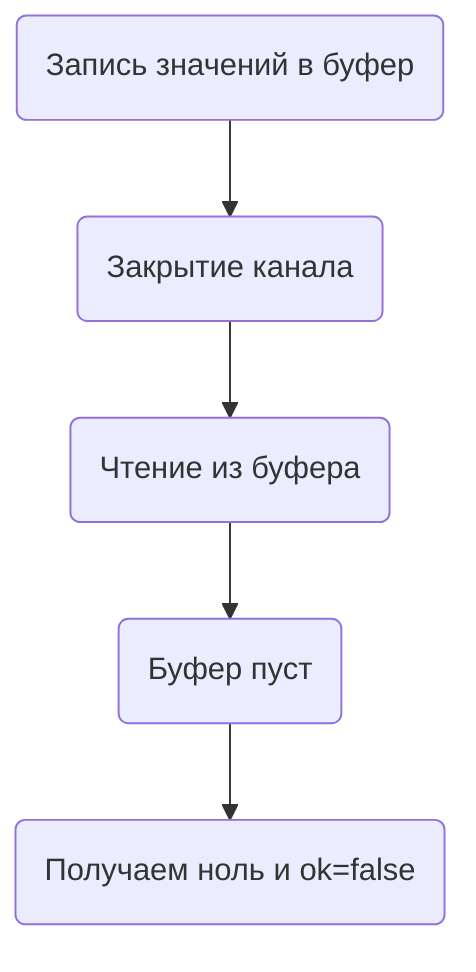

В Go выражение `v, ok := <-ch` используется для чтения из канала. Переменная `ok` показывает, удалось ли совершить корректное чтение: если канал открыт или в закрытом, но буферизованном канале еще остаются данные, то `ok` будет равно `true`. Когда канал закрыт и все значения из его буфера уже прочитаны, читающее выражение возвращает нулевое значение типа канала, а `ok` становится `false`.  

Таким образом, `ok` не указывает напрямую на состояние канала (открыт или закрыт), а лишь сигнализирует о том, было ли реально считано значение. Пока в буфере есть данные, чтение продолжается обычно, даже если канал уже закрыт.  

```go
package main

import "fmt"

func main() {
    ch := make(chan int, 2)
    ch <- 1
    ch <- 2
    close(ch)

    for {
        v, ok := <-ch
        if !ok {
            fmt.Println("Channel drained and closed")
            break
        }
        fmt.Println("Read value:", v)
    }
}
```



```old
// `v, ok := <-ch` - ok сообщает, получилось ли прочитать из канала (а не "канал открыт/закрыт"); только когда в (закрытом) буферизованном канале не осталось значений: v == 0, ok == false
```