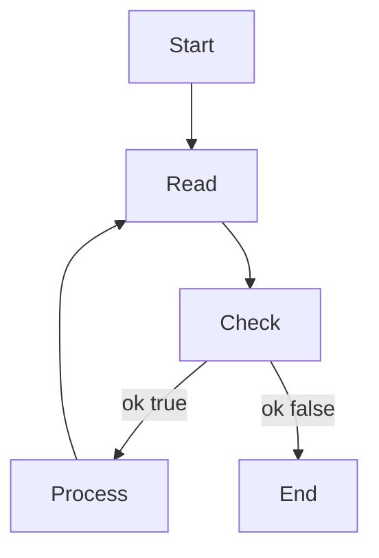

В Go при чтении из канала можно использовать конструкцию `value, ok := <-ch`. Она позволяет одновременно получить значение из канала и булевый флаг, который сообщает, открыт ли канал. Если канал закрыт и все значения уже извлечены, то `ok` будет `false`, а `value` примет нулевое значение типа. Такая форма чтения полезна для безопасного завершения работы горутин и избежания бесконечных блокировок.  

```go
ch := make(chan int)
go func() {
    ch <- 10
    close(ch)
}()
for {
    v, ok := <-ch
    if !ok {
        break
    }
    fmt.Println(v)
}
```



```old
// при чтении для канала можно использовать `value, ok := <-ch`
```