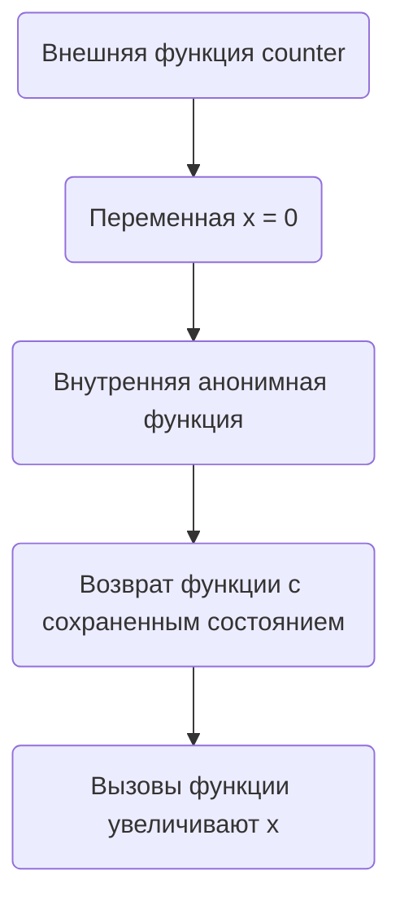

Замыкание в Go — это функция, которая захватывает переменные из внешней области видимости и может использовать или изменять их даже после завершения исполнения этой области. Таким образом, переменные становятся "связанными" с функцией, и состояние может сохраняться между вызовами. Это удобно для инкапсуляции, создания фабрик функций и управления состоянием без использования глобальных переменных.  

Пример:  
```go
package main

import "fmt"

func counter() func() int {
    x := 0
    return func() int {
        x++
        return x
    }
}

func main() {
    c := counter()
    fmt.Println(c()) // 1
    fmt.Println(c()) // 2
}
```  

Диаграмма:  


```old
// замыкание — это функция, которая ссылается на переменные вне своего тела
```