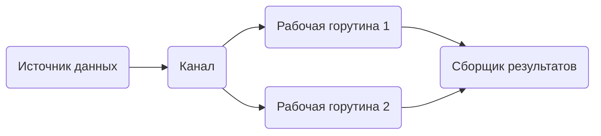

Проект **Go Concurrency Patterns** (https://github.com/Konstantin8105/Go-pipelines) демонстрирует ключевые приёмы организации конкурентных вычислений в Go через каналы и горутины. Главная идея заключается в том, чтобы строить системы как конвейеры: данные проходят через стадии обработки, каждая из которых работает параллельно и связана через каналы, минимизируя использование явной синхронизации и облегчая управление потоками данных.  

Такие шаблоны позволяют элегантно масштабировать работу, перераспределять нагрузку и проще контролировать завершение процессов. Например, можно создать горутину‑источник, несколько рабочих и сборщик результатов, где каждая стадия занимается своей задачей, а связь обеспечивается только каналами. Это повышает читаемость и надёжность кода при работе с параллельными вычислениями.  

```go
// Пример: генератор чисел и обработчик
func generator(nums ...int) <-chan int {
	out := make(chan int)
	go func() {
		for _, n := range nums {
			out <- n
		}
		close(out)
	}()
	return out
}

func square(in <-chan int) <-chan int {
	out := make(chan int)
	go func() {
		for n := range in {
			out <- n * n
		}
		close(out)
	}()
	return out
}
```  



```old
// повторить Go Cuncurrency Patterns https://github.com/Konstantin8105/Go-pipelines
```