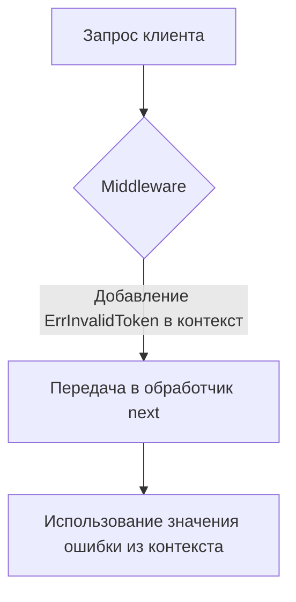

Этот фрагмент демонстрирует использование `context.WithValue` в Go для передачи информации об ошибке внутрь цепочки HTTP middleware. Контекст в Go позволяет хранить значения, которые можно безопасно передавать по вызовам функций и через обработчики HTTP. В данном случае в контекст текущего HTTP-запроса добавляется ключ `errorKey` и значение `ErrInvalidToken`, чтобы следующий обработчик `next` мог извлечь эту информацию и, например, корректно отобразить пользователю сообщение или записать лог.  

Таким образом, middleware служит промежуточным слоем, встраивающим "метку ошибки" прямо в контекст запроса — это упрощает архитектуру приложения, позволяя разделять ответственность: один слой устанавливает ошибку, другой ее обрабатывает.  



```old
// `return http.HandlerFunc(func(w http.ResponseWriter, r *http.Request) { ctx := context.WithValue(r.Context(), errorKey, ErrInvalidToken); next.ServeHTTP(w, r.WithContext(ctx)) }` - пример применения context.WithValue внутри http middleware для передачи сообщения об ошибке
```