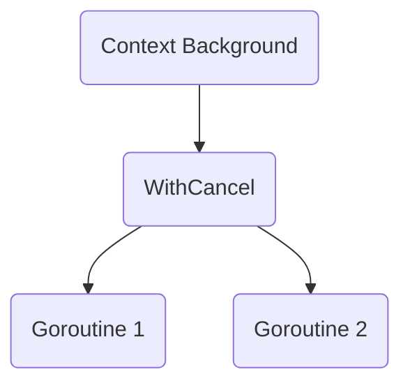

Репозиторий https://github.com/mcfly722/context демонстрирует устройство и особенности пакета `context` в Go, который используется для управления временем жизни операций и передачи сигналов об отмене между горутинами. Главный "секрет" заключается в том, что `context` не является магией — это по сути цепочка структур, каждая из которых может добавлять свой функционал (например отмену или дедлайн) к родительскому контексту. Когда вызывается отмена или истекает срок, сигнал последовательно передаётся вниз по этой цепочке ко всем связанным горутинам.

Для понимания можно представить это как дерево, в котором родительский `Context` передаёт дочерним события о закрытии или таймауте. Такой подход решает проблему контроля за множеством горутин, которые выполняют часть общей задачи — не нужно вручную отслеживать их завершение, достаточно грамотно построить контекст.  

Пример структуры контекста  
```go
ctx, cancel := context.WithCancel(context.Background())
defer cancel()
```

Диаграмма концепции:



```old
// https://github.com/mcfly722/context
```