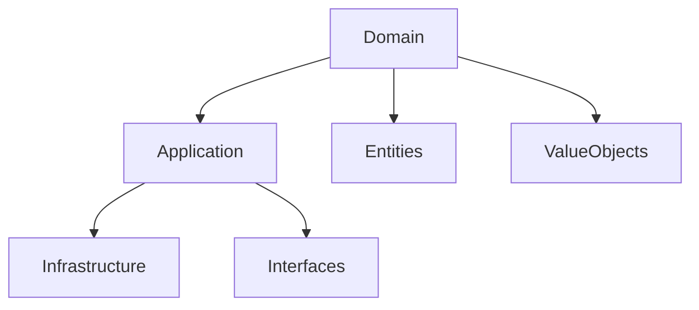

В этом видео объясняется, как Go удачно применяется в подходе Domain Driven Design. Основная идея — отделять доменную логику от инфраструктуры и деталей реализации. В Go это достигается через простоту интерфейсов и ясную организацию пакетов: сущности и агрегаты описываются в домене, сервисы реализуют применение бизнес‑правил, а интерфейсы позволяют подменять хранилища или внешние сервисы без жёсткой привязки.  

Такой подход помогает избежать смешивания инфраструктурного кода и доменной логики, делая систему модульной и легко расширяемой. Go со своей минималистичностью вынуждает проектировать чёткие границы, что идеально ложится на концепции DDD.  



```old
// - [Go в Domain Driven Design](https://youtu.be/JcsKI7QyDrs)
```