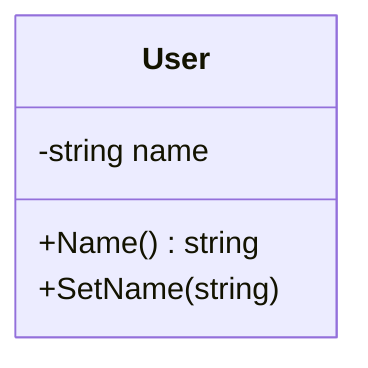

В Go не принято использовать префикс `Get` в именах геттеров — метод называется просто по имени возвращаемого свойства. Например, если у структуры есть поле `Name`, то метод-геттер называется `Name()`, а сеттер — `SetName(value)`. Такая конвенция делает код короче и читабельнее, а также лучше отражает принципы идиоматичного Go, где имена краткие и прямые.  

```go
type User struct {
    name string
}

func (u *User) Name() string {
    return u.name
}

func (u *User) SetName(n string) {
    u.name = n
}
```



```old
// геттеры-сеттеры применяются без префикса Get для геттера и с префиксом Set для сеттера
```