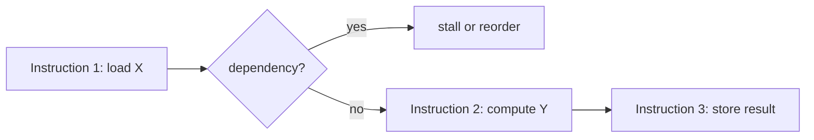

Инструкции в Go, как и в других языках, транслируются в машинный код, который процессор способен исполнять параллельно благодаря технике ILP (Instruction Level Parallelism). Суть ILP заключается в том, что процессор может одновременно готовить и выполнять сразу несколько инструкций, если между ними нет зависимостей по данным. Если же инструкции обращаются к одним и тем же переменным в разные моменты, это создаёт опасность данных (data hazard), из-за чего процессор вынужден ждать завершения предыдущей операции.  

Оптимизация заключается в том, чтобы перезаписать критичные участки программы так, чтобы инструкции были независимыми и могли выполняться параллельно. Например, можно переставить вычисления или использовать временные переменные, чтобы минимизировать зависимость между инструкциями. Это позволяет CPU загружать больше вычислительных блоков одновременно и ускорять выполнение программы.  



```old
// Используйте параллелизм на уровне инструкций (ILP) для оптимизации определенных частей кода, чтобы CPU мог выполнять как можно больше инструкций параллельно. Выявление опасностей данных — один из основных моментов, связанных с этим.
```