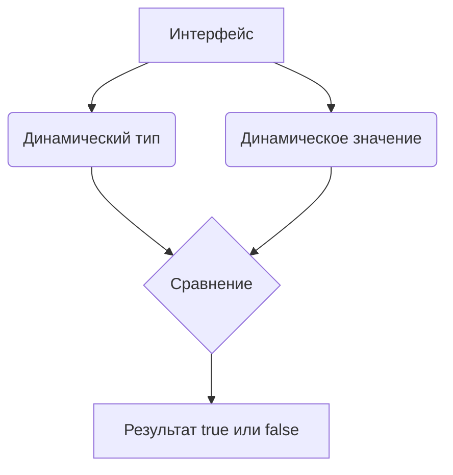

В Go сравнение интерфейсов через `==` и `!=` происходит не по ссылкам, а по их содержимому. У интерфейса есть два скрытых компонента — динамический тип и динамическое значение. Два интерфейса считаются равными, если оба они содержат одинаковый динамический тип и одинаковое динамическое значение, либо если оба являются `nil`. Если типы совпадают, но значения различны, результат будет `false`. Если хотя бы один интерфейс содержит значение несравнимого типа (например, срез или карту), операция сравнения вызовет панику.  

Пример кода:  
```go
var a interface{} = 10
var b interface{} = 10
var c interface{} = "10"

fmt.Println(a == b) // true, один тип int и одинаковое значение
fmt.Println(a == c) // false, разные типы
```  

Диаграмма:  


```old
// как сравниваются интерфейсы на == или !=: имеют ли два интерфейса одинаковые динамические типы и одинаковые динамические значения либо равны ли оба интерфейса nil
```