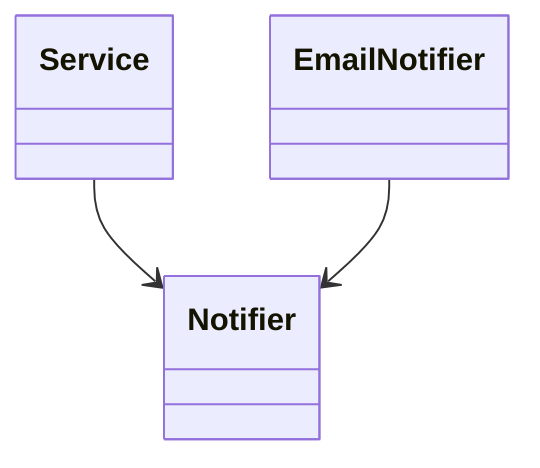

Интерфейсы в Go позволяют отделить высокоуровневую логику от низкоуровневых деталей, реализуя принцип инверсии зависимостей из SOLID. Вместо того чтобы конкретный модуль напрямую зависел от реализации, он работает через интерфейс, что делает код гибким, легко тестируемым и расширяемым. Такой подход упрощает замену реализаций без изменения основной бизнес-логики.  

Пример:  

```go
package main

import "fmt"

// Интерфейс
type Notifier interface {
    Notify(message string)
}

// Конкретная реализация
type EmailNotifier struct{}

func (e EmailNotifier) Notify(message string) {
    fmt.Println("Email:", message)
}

// Высокоуровневый модуль
type Service struct {
    notifier Notifier
}

func (s Service) Process() {
    s.notifier.Notify("Задача выполнена")
}

func main() {
    email := EmailNotifier{}
    service := Service{notifier: email}
    service.Process()
}
```

Диаграмма зависимостей:  



Таким образом, интерфейс служит прослойкой, через которую высокоуровневый код не зависит от деталей реализации, а наоборот — детали подчиняются абстракции.

```old
// Интерфейсы - способ, как сделать программу SOLIDной? (Dependency Inversion)
```