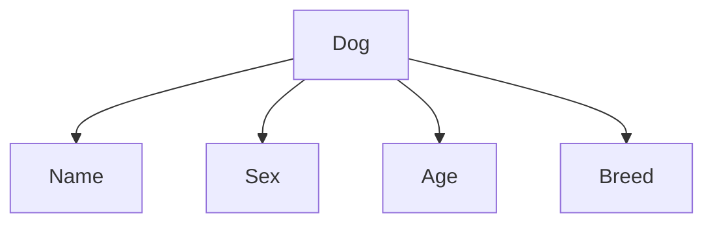

В Go литералы так же, как и в JavaScript, являются фиксированным способом записи значений прямо в коде. Числовые и строковые литералы выглядят привычно: `a := 1` или `s := "cat"`. Но более интересно устройство структурных и картовых литералов. Литерал структуры позволяет сразу инициализировать все необходимые поля новой структуры, а литерал карты — задать ключи и значения в хэш-таблице.  

Пример:  
```go
type Dog struct {
    Name  string
    Sex   string
    Age   int
    Breed string
}

func main() {
    dog := Dog{
        Name:  "Naya",
        Sex:   "female",
        Age:   2,
        Breed: "Rottweiler mix",
    }

    dogMap := map[string]interface{}{
        "name":  "Naya",
        "sex":   "female",
        "age":   2,
        "breed": "Rottweiler mix",
    }
}
```  

Диаграмма:  


Таким образом, литералы в Go являются простым и безопасным способом задания значений прямо в коде, при этом структура и карта выполняют ту же роль, что и объектный литерал в JavaScript.

```old
// `const dog = { name: 'Naya', sex: 'female', age: 2, breed: 'Rottweiler mix' };` - объектный литерал в JavaScript; по аналогии в GoLang есть понятия "литерал структуры" и "литерал карты". В компьютерных науках литерал - это текстовое представление значения, так как оно записано в исходном коде. a := 1; // 1 - это целочисленный литерал s := "cat"; // "cat" - это строковый литерал
```