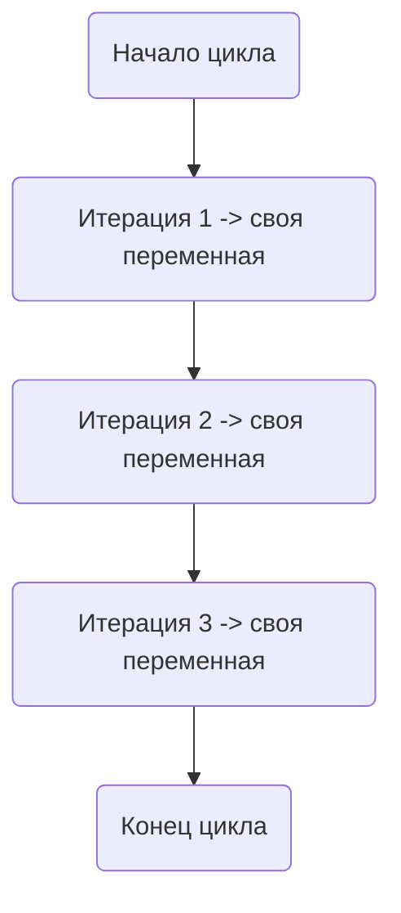

В Go до версии 1.22 переменная цикла в конструкциях `for range` фактически была одной и той же на всех итерациях, из-за чего при передаче её в замыкания или горутины нужно было делать хитрость вида `i := i`, чтобы захватить именно копию значения. Экспериментальная опция `GOEXPERIMENT=loopvar` меняет поведение рантайма так, что переменная цикла не переиспользуется, а создаётся новая копия на каждую итерацию. Это убирает необходимость в "хаках" и делает код проще и безопаснее.  

Пример разницы:  

```go
for i := 0; i < 3; i++ {
    go func() {
        fmt.Println(i) // раньше все горутины печатали одно и то же значение
    }()
}
```

С `GOEXPERIMENT=loopvar` каждая горутина напечатает своё значение, без `i := i`.  

Диаграмма итераций:  



```old
// GOEXPERIMENT=loopvar избавит от хака для циклов `i := i`
```