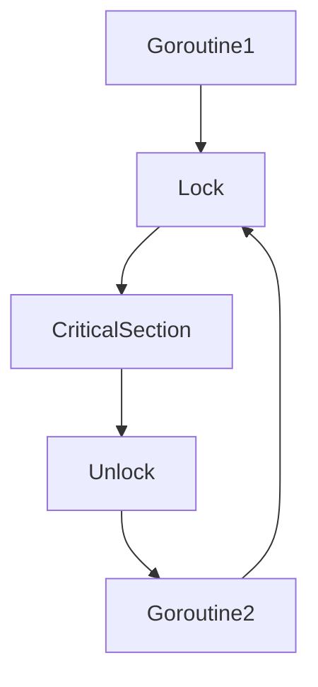

В Go `sync.Mutex` используется для взаимного исключения — это механизм, предотвращающий одновременный доступ нескольких горутин к одной и той же критической секции кода или общим данным. Он работает по принципу "lock/unlock": когда одна горутина захватывает мьютекс, все остальные, пытающиеся сделать то же самое, блокируются до тех пор, пока мьютекс не будет освобожден. Таким образом обеспечивается целостность и согласованность данных без гонок.  

Пример:

```go
var mu sync.Mutex
var counter int

func increment() {
    mu.Lock()
    counter++
    mu.Unlock()
}
```  

Диаграмма для наглядности:  



Мьютексы в Go — это фундаментальный инструмент синхронизации, который нужно использовать там, где требуется строго последовательный и безопасный доступ к данным из разных потоков исполнения.

```old
// mutex - образовано от "mutual exclusion"
```