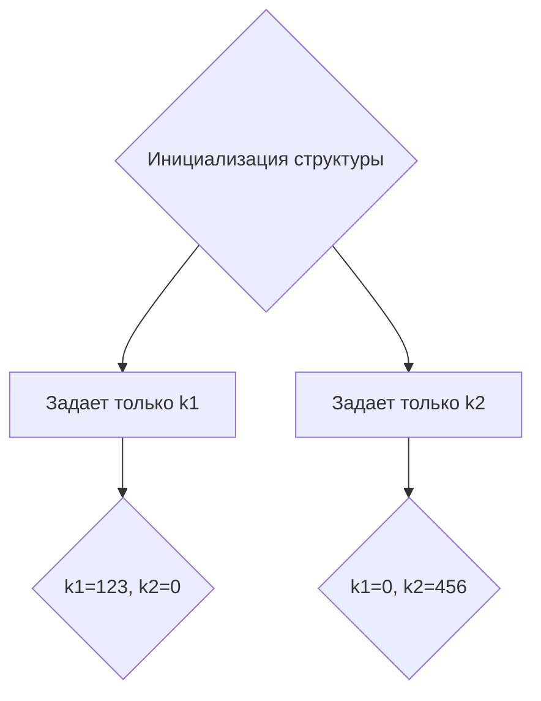

В Go при инициализации структур можно указывать значения только для части именованных полей. Остальные поля автоматически получат свои нулевые значения (для int это 0, для string — пустая строка и т.д.). Такой синтаксис удобен, если важно задать лишь несколько полей структуры, а остальные можно оставить по умолчанию.  

Это работает благодаря тому, что конструктор структур с именованными полями не требует указывать все значения в точности, и компилятор сам дополняет пропущенные поля их zero-values. Такой приём часто используют для повышения читаемости кода и упрощения инициализации сложных структур.  

```go
type MyType struct {
    k1 int
    k2 int
}

func main() {
    v1 := MyType{k1: 123}
    v2 := MyType{k2: 456}
    println(v1.k1, v1.k2) // 123 0
    println(v2.k1, v2.k2) // 0 456
}
```  



```old
// type MyType struct { k1 int; k2 int } - можно инициализировать не все именованные поля, например: v := MyType{k1:123}; v := MyType{k2:123}
```