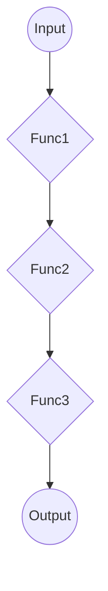

В Go можно имитировать стиль конвейеров, похожий на Elixir, используя набор функций, которые последовательно принимают и возвращают значения. Для этого часто применяют функцию `pipe`, которая принимает исходное значение и список функций, затем применяет каждую по цепочке. Это позволяет писать более декларативный и читаемый код, вместо вложенных вызовов.  

В статье предлагается библиотека **gofn** и подход, где функция `Pipe` помогает записывать последовательность преобразований в функциональном стиле. Таким образом создаётся простая композиция: данные "текут" через набор функций, что облегчает понимание логики программы.  

```go
func Pipe(val interface{}, fns ...func(interface{}) interface{}) interface{} {
    result := val
    for _, fn := range fns {
        result = fn(result)
    }
    return result
}
```  



См. оригинал: https://devevangelista.medium.com/functional-programming-in-go-an-adventure-with-gofn-and-pipe-de42b3a76449

```old
// pipe in GoLang like Elixir https://devevangelista.medium.com/functional-programming-in-go-an-adventure-with-gofn-and-pipe-de42b3a76449
```