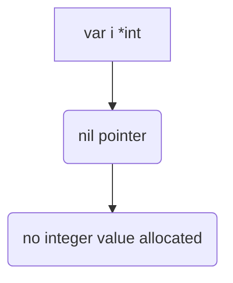

В Go при объявлении переменной `var i *int` создаётся указатель на тип `int`, но сам указатель инициализируется нулевым значением по умолчанию — `nil`, а не указывает на число `0`. То есть в памяти нет выделенного целочисленного значения, к которому можно было бы обратиться. Чтобы получить рабочий указатель, его нужно явно инициализировать, например через оператор `new(int)` или взять адрес у существующей переменной.  

Диаграмма инициализации:  



```old
// var i *int - не инициализирует числовое значение, как 0.
```