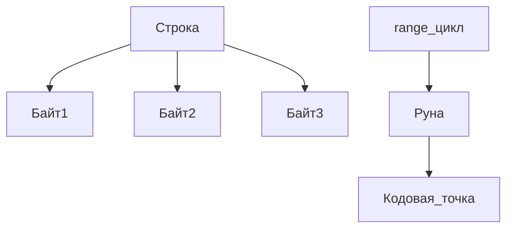

В Go тип `rune` это просто псевдоним для `int32`, который хранит кодовую точку Unicode. Например, символ `汉` имеет кодовую точку U+6C49, что соответствует десятичному числу 27721. Когда такой символ кодируется в UTF-8, он занимает три байта: `0xE6 0xB1 0x89`. Благодаря этому Go может одинаково работать как с отдельными байтами строки, так и с полноценными Unicode-рунами.

Основной «секрет» в том, что строка в Go — это неизменяемая последовательность байтов, а не рун. При итерации по строке с помощью `for range`, компилятор декодирует UTF-8 и возвращает именно руны, а не отдельные байты, что сильно упрощает работу с международным текстом. Таким образом, один символ может занимать разное количество байтов, но при обходе строк мы всегда получаем корректные Unicode-символы.  

```go
package main

import "fmt"

func main() {
    s := "汉"
    fmt.Println(len(s))       // 3: количество байтов
    fmt.Println([]byte(s))    // [230 177 137]
    fmt.Println([]rune(s))    // [27721]
    for i, r := range s {
        fmt.Printf("%d -> %c\n", i, r)
    }
}
```  



```old
// символ: 汉; кодовая точка unicode (или rune): U+6C49; кодирование тремя байтами в UTF-8: 0xE6, 0xB1, 0x89
```