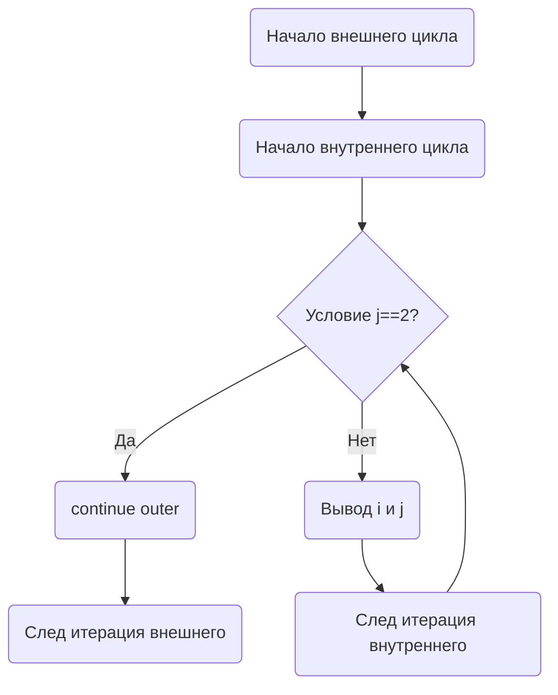

В Go конструкция `continue` может использоваться не только для перехода к следующей итерации текущего цикла, но и совместно с меткой для управления вложенными циклами. Это позволяет пропустить выполнение оставшейся части тела внутреннего цикла и сразу перейти к следующей итерации внешнего цикла, что бывает удобно при сложных условиях выхода.  

Пример кода:  
```go
package main

import "fmt"

func main() {
outer:
    for i := 1; i <= 3; i++ {
        for j := 1; j <= 3; j++ {
            if j == 2 {
                continue outer
            }
            fmt.Println("i =", i, "j =", j)
        }
    }
}
```

Диаграмма:  


Здесь выполнение при `j == 2` перепрыгивает сразу к следующему шагу внешнего цикла, минуя остальные внутренние итерации.

```old
// continue тоже можно использовать с меткой
```