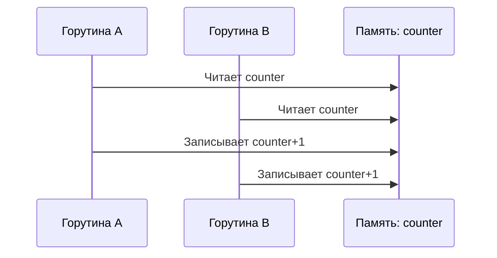

Гонка данных в Go ― это ситуация, когда несколько горутин одновременно работают с одной и той же областью памяти, и хотя бы одна из них выполняет запись. Такая ситуация делает поведение программы непредсказуемым: результат может отличаться от запуска к запуску, причём не всегда наблюдается одна и та же ошибка. При этом важно отличать состояние гонки данных от недетерминированного поведения: даже при правильной синхронизации результат может варьироваться, но это уже контролируемое и безопасное недетерминистическое выполнение.  

Для наглядности пример кода:  
```go
package main

import (
	"fmt"
	"time"
)

var counter int

func main() {
	for i := 0; i < 5; i++ {
		go func() {
			counter++
		}()
	}
	time.Sleep(time.Second)
	fmt.Println("Counter:", counter)
}
```



Здесь несколько горутин одновременно изменяют одну переменную без синхронизации, из-за чего теряются инкременты и результат работы программы становится нестабильным.

```old
// Гонка данных происходит, когда несколько горутин одновременно обращаются к одной и той же ячейке памяти (например, к одной и той же переменной) и по крайней мере одна из горутин выполняет запись. Важно понимать, что отсутствие гонки данных необязательно будет выдавать детермирнированный результат (состояние гонки - отдельное понятие).
```