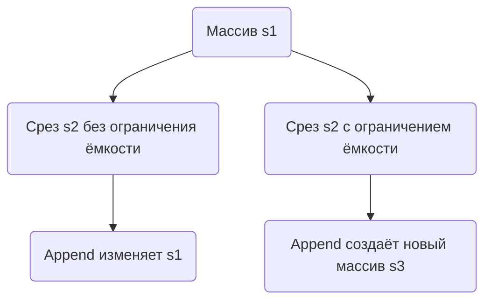

В Go срезы являются "окнами" в массив, и операция `append` может изменить исходный массив, если у среза остаётся запас по ёмкости. В примере `s2 := s1[1:2]` срез `s2` всё ещё указывает на массив `s1`, и у него есть свободная ёмкость для записи, поэтому `append(s2, 10)` перезаписывает элемент в `s1`. В итоге меняется не только новый срез, но и исходный.  

Чтобы избежать такого побочного эффекта, можно ограничить ёмкость среза явно с помощью трёхиндексного оператора: `s2 := s1[1:2:2]`. В этом случае у `s2` больше нет дополнительной ёмкости, и при `append` Go создаёт новый массив, не трогая исходный.  



```old
// `s1 := []int{1, 2, 3}; s2 := s1[1:2]; s3 := append(s2, 10)` побочный эффект: `s1=[1 2 10], s2=[2], s3=[2 10]`; как этого избежать: `s2 := s1[1:2:2]`
```