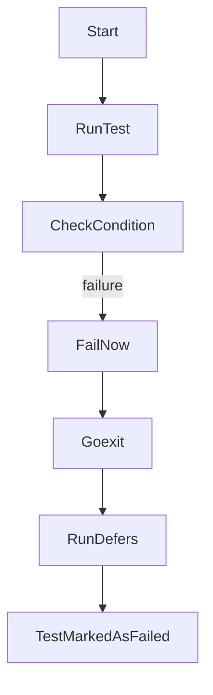

`FailNow` в пакете `testing` немедленно завершает выполнение текущего теста, вызывая внутри `runtime.Goexit`. Это гарантирует выполнение всех отложенных (`defer`) вызовов в рамках текущей горутины, но при этом тест считается упавшим. Такой механизм позволяет корректно закрывать ресурсы или логировать данные перед остановкой теста, без выхода из всей программы.  

Чтобы понять это лучше, можно представить: при вызове `t.FailNow()` исполнение текущего теста разрывается на месте, но перед этим выполняются все запланированные действия завершения, после чего управление возвращается в тестовый рантайм Go. Этот приём используется для аккуратного завершения тестов, когда продолжение их работы бессмысленно.  



```old
// (testing.T).FailNow() - FailNow помечает функцию как не выполнившуюся и останавливает ее выполнение вызовом runtime.Goexit (при этом выполняются все отложенные вызовы в текущей горутине).
```