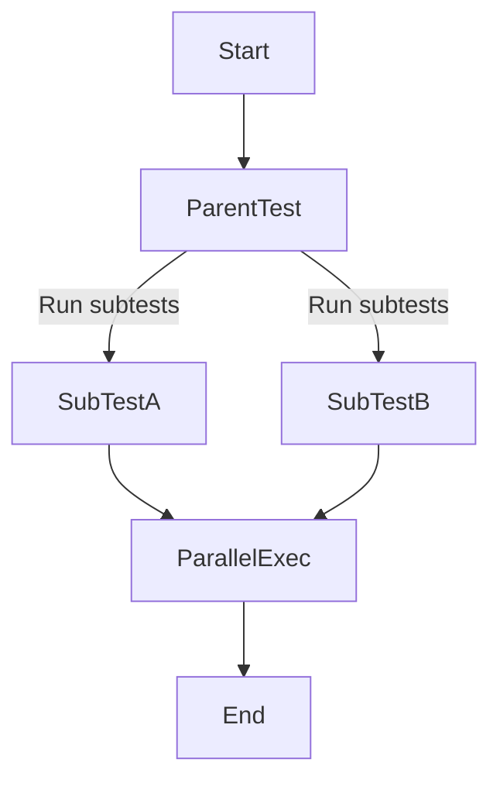

В Go метод `t.Parallel()` указывает, что данный тест или под-тест может выполняться одновременно с другими. Это удобно для ускорения тестирования и проверки корректности параллельного кода. При вызове этого метода выполнение текущего теста откладывается до тех пор, пока его родительский тест не завершит свою последовательную часть. После этого тест запускается в отдельной горутине, что позволяет существенно сократить общее время на проверку большого набора однотипных кейсов.  

Важно учитывать, что тесты, использующие `t.Parallel()`, должны быть независимыми друг от друга и не обращаться одновременно к общей изменяемой памяти без синхронизации. В противном случае результат может стать непредсказуемым.  

```go
func TestParallel(t *testing.T) {
    t.Run("A", func(t *testing.T) {
        t.Parallel()
        // тест A
    })
    t.Run("B", func(t *testing.T) {
        t.Parallel()
        // тест B
    })
}
```



```old
// (testing.T).Parallel() - метка о том, что тест должен выполняться параллельно
```