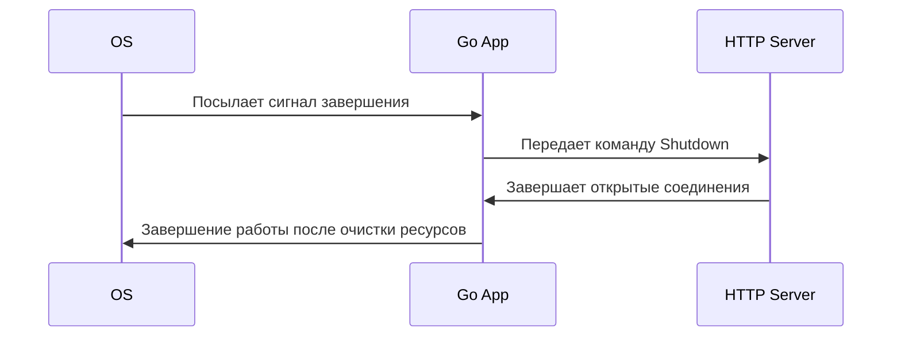

Graceful shutdown в Go — это подход, при котором приложение корректно завершает работу, дожидаясь завершения всех активных процессов и высвобождая ресурсы перед закрытием. Обычно это реализуется через перехват сигналов операционной системы (например SIGINT или SIGTERM), запуск контекста с таймаутом и корректное завершение фоновых горутин, соединений к БД, HTTP‑серверов. Такой метод позволяет избежать ситуации, когда запросы обрываются внезапно или данные теряются.  

Пример для HTTP‑сервера на Go:  

```go
srv := &http.Server{Addr: ":8080"}
go func() {
    if err := srv.ListenAndServe(); err != nil && err != http.ErrServerClosed {
        log.Fatalf("listen: %s\n", err)
    }
}()

quit := make(chan os.Signal, 1)
signal.Notify(quit, syscall.SIGINT, syscall.SIGTERM)
<-quit

ctx, cancel := context.WithTimeout(context.Background(), 5*time.Second)
defer cancel()
if err := srv.Shutdown(ctx); err != nil {
    log.Fatal("Server Shutdown:", err)
}
```

Диаграмма в mermaid, отображающая процесс:  



```old
// благодатное выключение - Graceful Shutdown
```