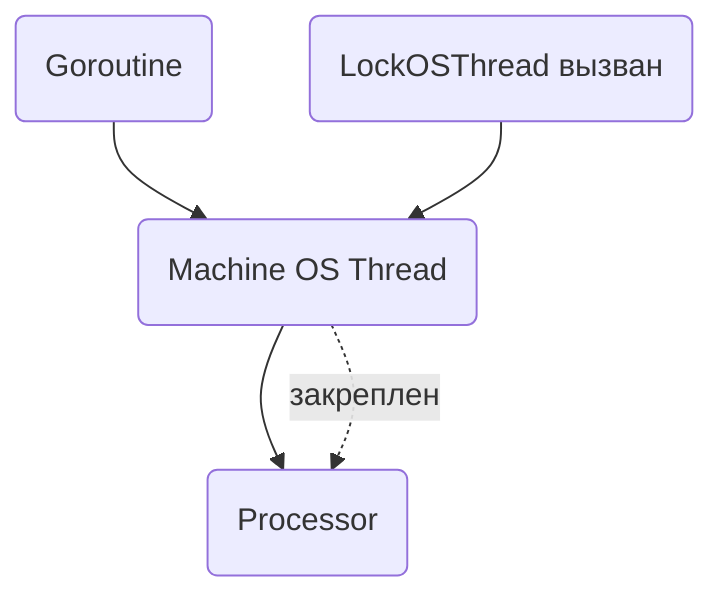

`runtime.LockOSThread()` в Go закрепляет выполнение текущего goroutine за конкретным системным потоком ОС. Это гарантирует, что выполнение не "перепрыгнет" на другой поток при планировании, что важно, когда поток взаимодействует с внешними библиотеками или системными вызовами, завязанными на состояние конкретного треда, например при работе с графическими API или при использовании особых системных вызовов.  

Внутри планировщика Go это фактически означает, что определенный M (machine, системный поток) будет закреплен за конкретным P (processor, сущность планировщика) и не отдаст его другим. Это позволяет сохранить все локальные кеши и регистровое состояние, не нарушая работу кода, требующего стабильного окружения.  



```old
// runtime.LockOSThread() лочит P на M неразмывая кеши ядра и т.п.
```