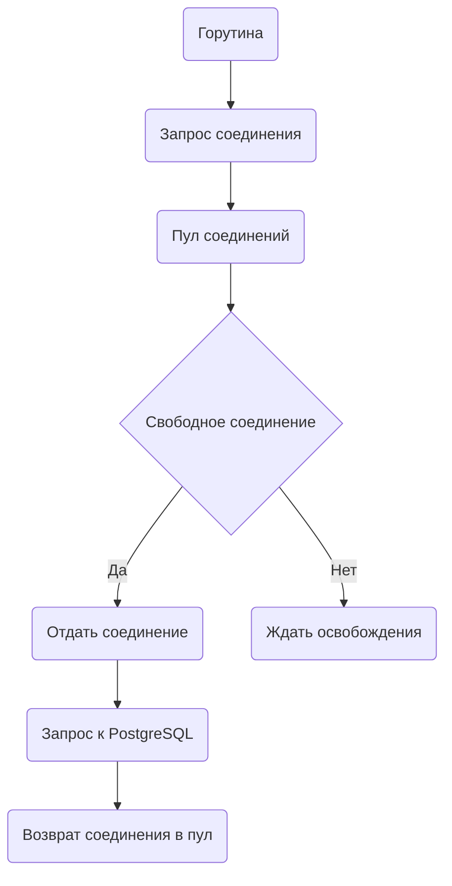

`pgxpool` из пакета `jackc/pgx/v5/pgxpool` предоставляет пул подключений к PostgreSQL, позволяя эффективно использовать ограниченное число соединений многими горутинами. Это снижает накладные расходы при открытии и закрытии соединений и дает дополнительные возможности управления, такие как лимит соединений, тестирование живости и автоматическое восстановление. В отличие от простого использования драйвера или `go-pg`, `pgxpool` оптимизирован под высоконагруженные сценарии и делает работу с БД более устойчивой.  

Идея пула проста — каждая горутина запрашивает соединение не из "нуля", а у пула, выполняет запрос и возвращает соединение обратно. Таким образом достигается баланс между эффективностью и безопасностью.  

Диаграмма:  



```old
// jackc/pgx/v5/pgxpool / go-pg + pool - PG Pool
```