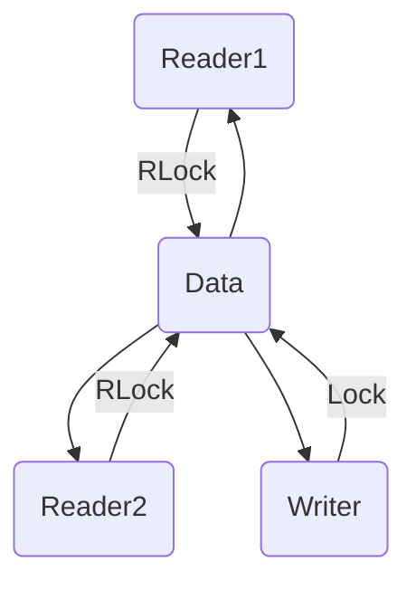

`RWMutex` в Go — это механизм синхронизации, который позволяет разделять доступ к данным: множество горутин могут одновременно читать ресурс, но только одна может его изменять, и в момент записи доступ полностью блокируется. Таким образом, когда чтений больше, чем записей, использование `RWMutex` эффективнее, чем обычного `Mutex`, так как операции чтения не блокируют друг друга и выполняются почти параллельно.  

Однако запись блокирует и другие записи, и все чтения, что делает операции дороже примерно на 30% по сравнению с `Mutex`. Следовательно, `RWMutex` имеет смысл применять только в системах, где доминируют операции чтения.  

```go
var mu sync.RWMutex
var data int

func read() int {
    mu.RLock()
    defer mu.RUnlock()
    return data
}

func write(val int) {
    mu.Lock()
    defer mu.Unlock()
    data = val
}
```



```old
// RWMutex - читаем без блокировок на чтение, но с блокировкой на запись при чтении(!), или записи (но сильно дороже, чем просто Mutex - механизм блокировки примерно на 30%; имеет смысл, если преобладает чтение над записью, т.к. чтение легковесное)
```