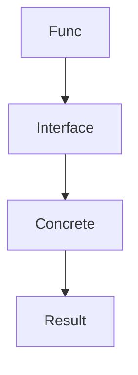

Этот принцип в Go предлагает принимать интерфейсы в сигнатуры функций (чтобы вызывать код с любыми совместимыми реализациями), но возвращать из функций конкретные типы, а не интерфейсы. Такой подход упрощает тестирование и дальнейшее использование результата — возвращаемый объект сохраняет все свои методы, а не только ограничения интерфейса, тем самым предоставляя больше возможностей потребителям функции.  

Например:  

```go
package main

import "fmt"

type Writer interface {
    Write(msg string)
}

type ConsoleWriter struct{}

func (cw ConsoleWriter) Write(msg string) {
    fmt.Println(msg)
}

// Принимаем интерфейс Writer, но возвращаем конкретный тип
func NewConsoleWriter(w Writer) ConsoleWriter {
    return ConsoleWriter{}
}

func main() {
    cw := NewConsoleWriter(ConsoleWriter{})
    cw.Write("Привет")
}
```  



Таким образом можно гибко использовать абстракции на входе и при этом сохранять богатые возможности конкретных реализаций на выходе.

```old
// accept interfaces, return concrete types
```