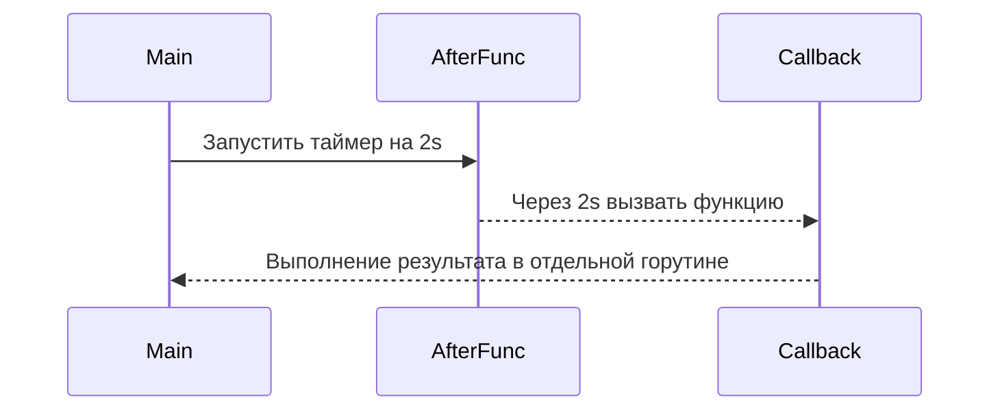

`time.AfterFunc` в Go позволяет запускать функцию через заданный промежуток времени, не блокируя исполнение основной программы. По сути, это сочетание таймера и callback: вы указываете длительность и функцию, которая будет вызвана после её истечения. В отличие от `time.Sleep`, который просто приостанавливает выполнение текущей горутины, `time.AfterFunc` запускает callback асинхронно в отдельной горутине, что делает его удобным для отложенных действий или планирования событий.  

Пример:  

```go
package main

import (
	"fmt"
	"time"
)

func main() {
	time.AfterFunc(2*time.Second, func() {
		fmt.Println("Сработало через 2 секунды")
	})
	time.Sleep(3 * time.Second)
}
```

Диаграмма работы:  



```old
// time.AfterFunc - возможность вызвать callback
```