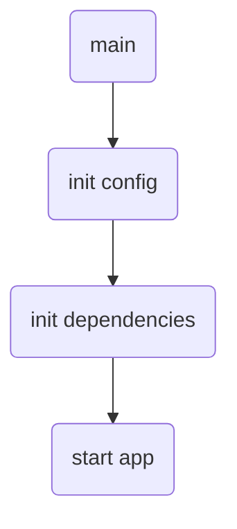

Секрет в том, что в Go функция `main` может оставаться максимально «божественно» чистой — она сама по себе лишь точка входа, а вся логика, конфигурации и зависимости выносятся наружу. Таким образом, `main.go` превращается в ясный сценарий запуска: инициализируем нужные сервисы, подключаем зависимости, запускаем приложение. Такой подход упрощает тестирование, так как основной код не замешан в грязи инициализации, а также делает проект читаемым и структурированным.  

Например, схема может выглядеть так:  



```old
// "божественный" main.go - это прекрасно, каждый раз так делаю и всем советую
```