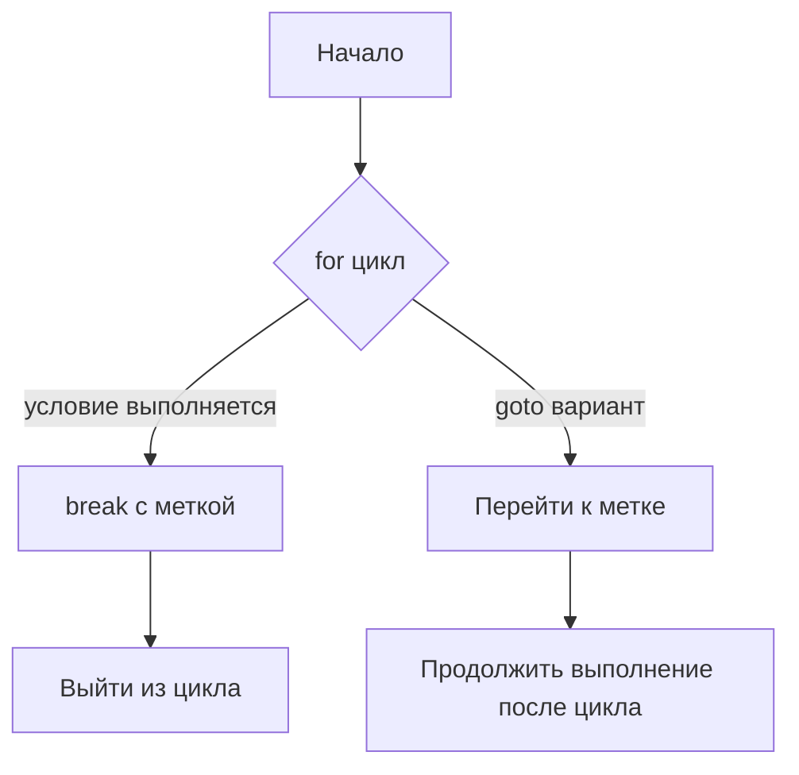

В Go оператор `break` с меткой прерывает выполнение цикла или блока `switch` до конца указанного уровня, а `goto` переносит выполнение к определенной метке в коде. Разница в том, что `break` завершает именно обозначенный цикл или `switch`, сохраняя структурированность кода, тогда как `goto` просто перескакивает в указанное место, что может усложнить логику и снизить читаемость.  

Например, метка перед `for` с `break loop` завершит этот цикл при срабатывании условия, а конструкция с `goto next` просто перепрыгнет к метке сразу после цикла. Таким образом, `break` естественнее для управления циклами, а `goto` — более универсальный, но менее рекомендуемый для таких случаев инструмент.  

```go
loop:
for {
    switch {
    case true:
        break loop
    }
}

for {
    switch {
    case true:
        goto next
    }
}
next:
```  



```old
// break loop VS goto next; `loop:` перед for: `loop:for{switch{case true: break loop}}` или `next:` после for: `for{switch{case true: goto next}}next:`
```