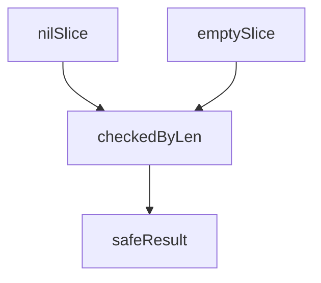

В Go существует различие между нулевым значением среза или карты и их пустым состоянием. Нулевой срез или карта не имеют выделенной памяти и равны `nil`, тогда как пустой срез или карта могут ссылаться на уже созданную структуру, но размер ее равен нулю. Именно поэтому для проверки на пустоту рекомендуется использовать функцию `len()`, которая одинаково корректно обрабатывает оба случая, вместо сравнения с `nil`. Это избавляет от ошибок, когда объект есть, но элементов нет.  

Пример:  
```go
var a []int    // nil slice
b := []int{}   // empty slice

fmt.Println(len(a) == 0) // true
fmt.Println(len(b) == 0) // true
```  

Диаграмма:  


```old
// пустоту среза/карты всегда следует проверять через len(), чтобы избежать разницу между пустым и нулевым срезом/картой
```