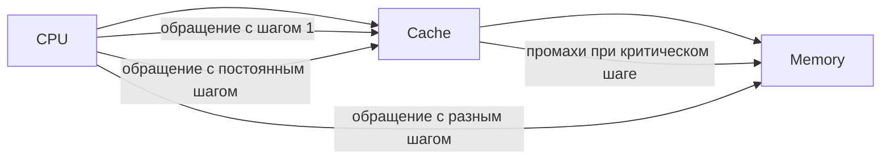

Когда процессор обращается к данным в памяти, он загружает их кусками в кэш. Если данные читаются последовательно (unit stride) или с предсказуемым шагом (constant stride), это эффективно, так как кэш подготавливает нужные строки заранее. Но при нерегулярных доступах (non-unit stride, например, по указателям в связном списке) процессор не может предсказать шаг, и кэш часто промахивается. Критический шаг (critical stride) особенно опасен — он вызывает ситуацию, когда данные постоянно попадают в одно и то же место в кэше, вытесняя друг друга и фактически лишая процессор преимуществ кэширования.  

В Go и других языках на высоком уровне это значит: работа с срезами и массивами с последовательным обходом будет заметно быстрее и предсказуемее, чем обход по указателям случайным образом. Современные процессоры и оптимизации в Go умеют частично сглаживать такие эффекты, но учитывать поведение кэша важно, особенно в производительном коде.  



```old
// Как процессоры работают с данными: Unit stride, Constant stride, Non-unit stride, Critical stride (следует избегать, но пример из книжки не воспроизводится, видимо Go продвинулся в решении вопросов кеширования). Предсказуемость поведения кода для CPU также может быть эффективным способом оптимизации определенных функций. Например, единичный или постоянный шаг предсказуем для CPU, а неединичный шаг (например, связ- ный список) непредсказуем. Чтобы избежать критических шагов и, следовательно, использования только крошечной части кэша, имейте в виду, что кэши разбиваются на сектора.
```