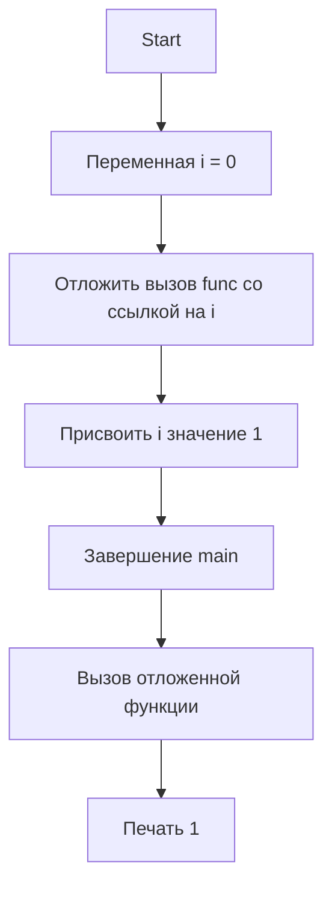

В Go оператор `defer` откладывает вызов функции до выхода из текущей функции. В приведенном примере в `defer` передается анонимная функция, которой сразу же передают указатель на переменную `i`. Это значит, что внутри отложенной функции всегда используется актуальное значение по указателю, а не копия самого `i` на момент объявления `defer`. Поскольку после отложенной записи выполняется `i = 1`, в момент вызова отложенной функции значение по указателю будет уже изменено, и на экран выведется `1`.  

Таким образом, главное отличие — использование указателя. Если бы в `defer` передавался `i` как значение, напечаталось бы `0`, но так как передан `&i`, мы видим обновлённое значение при окончании функции.  

```go
package main

func main() {
    var i int
    defer func(i *int) { println(*i) }(&i)
    i = 1
}
```  

Диаграмма выполнения:  



```old
// var i int; defer func(i *int) { println(*i) }(&i); i = 1 - выведет 1
```